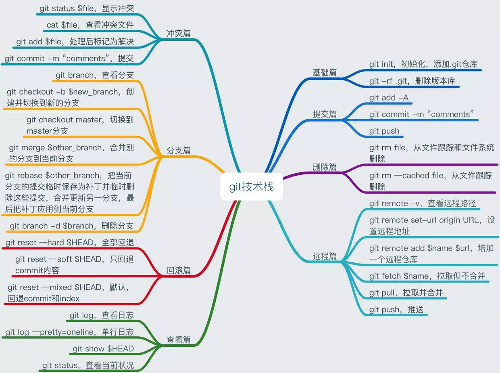

# git 简易使用手册
📕git 简易使用手册，包教不包会

在实际开发中希望在代码管理上花的时间越来越少，git 正好可以满足。本手册目标是让大家了解并会使用git。

实际项目联合开发7人，自从使用git，配合便很流畅。应用方案在lesson1中。

## 课程列表
* [本地仓库][1]
* [远程仓库][2]
* [分支的衍合-rebase][3]
* [Code Review][4]
* [iOS发布流程和分支使用][5]

[1]:	https://github.com/AlfredTheBest/git-handbook/tree/master/lesson0
[2]:	https://github.com/AlfredTheBest/git-handbook/tree/master/lesson1
[3]:	https://github.com/AlfredTheBest/git-handbook/tree/master/lesson2
[4]:	https://github.com/AlfredTheBest/git-handbook/tree/master/lesson3
[5]:	https://github.com/AlfredTheBest/git-handbook/tree/master/lesson4