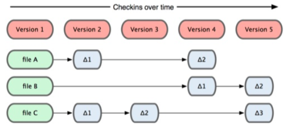
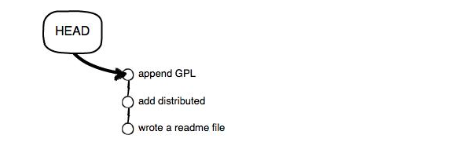

#git 本地仓库
 ##Git基础
 
 直接记录快照，而非差异比较。Git和其他版本控制系统的主要差别在于，Git只关心文件数据的整体是否发生变化，而大多数其他的系统则只关心文件内容的具体差异。这类系统(CVS，Subversion，perforce等等)每次纪录有哪些文件做了更新，以及都更新了哪些行的什么内容。



Git并不保存这些前后变化的差异数据。实际上，git更像是把变化的文件做快照后，记录在一个微型的文件系统中。每次提交更新时，它会纵览一遍所有文件的指纹信息并对文件做一快照，然后保存一个指向这次快照的索引为了提高性能，若文件没有变化，git不会再次保存，而只对上次保存的快照做一链接。


##安装Git

在Linux上安装Git

`sudo apt-get install git`

在Mac上安装Git

`brew install git`
##提交文件
通过git init命令把这个目录变成Git可以管理的仓库

用命git add告诉Git，把文件添加到仓库

`$ git add readme.txt`

用用命令git commit告诉Git，把文件提交到仓库

```
$ git commit -m "wrote a readme file"
[master (root-commit) cb926e7] wrote a readme file
 1 file changed, 2 insertions(+)
 create mode 100644 readme.txt
```
git commit命令，-m后面输入的是本次提交的说明，可以输入任意内容，当然最好是有意义的，这样你就能从历史记录里方便地找到改动记录。

为什么Git添加文件需要add，commit一共两步呢？因为commit可以一次提交很多文件，所以你可以多次add不同的文件，比如：

```
$ git add file1.txt
$ git add file2.txt file3.txt
$ git commit -m "add 3 files."
```
##基本状态
git status命令可以让我们时刻掌握仓库当前的状态

```
$ git status
# On branch master
# Changes not staged for commit:
#   (use "git add <file>..." to update what will be committed)
#   (use "git checkout -- <file>..." to discard changes in working directory)
#
#    modified:   readme.txt
#
no changes added to commit (use "git add" and/or "git commit -a")
```
知道了对readme.txt作了什么修改后，再把它提交到仓库就放心多了，提交修改和提交新文件是一样的两步，第一步是git add：

`$ git add readme.txt`

同样没有任何输出。在执行第二步git commit之前，我们再运行git status看看当前仓库的状态：

```
$ git status
# On branch master
# Changes to be committed:
#   (use "git reset HEAD <file>..." to unstage)
#
#       modified:   readme.txt
#
```
git status告诉我们，将要被提交的修改包括readme.txt，下一步，就可以放心地提交了：

```
$ git commit -m "add distributed"
[master ea34578] add distributed
 1 file changed, 1 insertion(+), 1 deletion(-)
```
提交后，我们再用git status命令看看仓库的当前状态：

```
$ git status
# On branch master
nothing to commit (working directory clean)
```

* 要随时掌握工作区的状态，使用git status命令
* 如果git status告诉你有文件被修改过，用git diff可以查看修改内容。

##版本回退
git log命令显示从最近到最远的提交日志。
如果嫌输出信息太多，看得眼花缭乱的，可以试试加上--pretty=oneline参数：

```
$ git log --pretty=oneline
3628164fb26d48395383f8f31179f24e0882e1e0 append GPL
ea34578d5496d7dd233c827ed32a8cd576c5ee85 add distributed
cb926e7ea50ad11b8f9e909c05226233bf755030 wrote a readme file
```

需要友情提示的是，你看到的一大串类似3628164...882e1e0的是commit id（版本号），和SVN不一样，Git的commit id不是1，2，3……递增的数字，而是一个SHA1计算出来的一个非常大的数字，用十六进制表示，而且你看到的commit id和我的肯定不一样，以你自己的为准。为什么commit id需要用这么一大串数字表示呢？因为Git是分布式的版本控制系统，后面我们还要研究多人在同一个版本库里工作，如果大家都用1，2，3……作为版本号，那肯定就冲突了。

好了，现在我们启动时光穿梭机，准备把readme.txt回退到上一个版本，也就是“add distributed”的那个版本，怎么做呢？

首先，Git必须知道当前版本是哪个版本，在Git中，用`HEAD`表示当前版本，也就是最新的提交`3628164...882e1e0`（注意我的提交ID和你的肯定不一样），上一个版本就是`HEAD^`，上上一个版本就是`HEAD^^`，当然往上100个版本写100个^比较容易数不过来，所以写成`HEAD~100`。

现在，我们要把当前版本“append GPL”回退到上一个版本“add distributed”，就可以使用git reset命令：

```
$ git reset --hard HEAD^
HEAD is now at ea34578 add distributed
```

还可以继续回退到上一个版本wrote a readme file，不过且慢，然我们用git log再看看现在版本库的状态：

```
$ git log
commit ea34578d5496d7dd233c827ed32a8cd576c5ee85
Author: Michael Liao <askxuefeng@gmail.com>
Date:   Tue Aug 20 14:53:12 2013 +0800

    add distributed

commit cb926e7ea50ad11b8f9e909c05226233bf755030
Author: Michael Liao <askxuefeng@gmail.com>
Date:   Mon Aug 19 17:51:55 2013 +0800

    wrote a readme file
```
最新的那个版本append GPL已经看不到了！好比你从21世纪坐时光穿梭机来到了19世纪，想再回去已经回不去了，肿么办？

办法其实还是有的，只要上面的命令行窗口还没有被关掉，你就可以顺着往上找啊找啊，找到那个append GPL的commit id是3628164...，于是就可以指定回到未来的某个版本：

```
$ git reset --hard 3628164
HEAD is now at 3628164 append GPL
```

Git的版本回退速度非常快，因为Git在内部有个指向当前版本的HEAD指针，当你回退版本的时候，Git仅仅是把HEAD从指向append GPL：


改为指向add distributed：

然后顺便把工作区的文件更新了。所以你让HEAD指向哪个版本号，你就把当前版本定位在哪。

现在，你回退到了某个版本，关掉了电脑，第二天早上就后悔了，想恢复到新版本怎么办？找不到新版本的`commit id`怎么办？

在Git中，总是有后悔药可以吃的。当你用`$ git reset --hard HEAD^`回退到add distributed版本时，再想恢复到append GPL，就必须找到append GPL的`commit id`。Git提供了一个命令`git reflog`用来记录你的每一次命令：

```
$ git reflog
ea34578 HEAD@{0}: reset: moving to HEAD^
3628164 HEAD@{1}: commit: append GPL
ea34578 HEAD@{2}: commit: add distributed
cb926e7 HEAD@{3}: commit (initial): wrote a readme file
```

* HEAD指向的版本就是当前版本，因此，Git允许我们在版本的历史之间穿梭，使用命令git reset --hard commit_id。
* 穿梭前，用git log可以查看提交历史，以便确定要回退到哪个版本。
* 要重返未来，用git reflog查看命令历史，以便确定要回到未来的哪个版本。

##工作区和暂存区
Git和其他版本控制系统如SVN的一个不同之处就是有暂存区的概念。

####工作区（Working Directory）
就是你在电脑里能看到的目录，比如我的learngit文件夹就是一个工作区

####版本库（Repository）
工作区有一个隐藏目录.git，这个不算工作区，而是Git的版本库。

Git的版本库里存了很多东西，其中最重要的就是称为stage（或者叫index）的暂存区，还有Git为我们自动创建的第一个分支master，以及指向master的一个指针叫HEAD。


分支和`HEAD`的概念我们以后再讲。

前面讲了我们把文件往Git版本库里添加的时候，是分两步执行的：

* 第一步是用git add把文件添加进去，实际上就是把文件修改添加到暂存区；
* 第二步是用git commit提交更改，实际上就是把暂存区的所有内容提交到当前分支。

因为我们创建Git版本库时，Git自动为我们创建了唯一一个`master`分支，所以，现在，`git commit就是往`master`分支上提交更改。

你可以简单理解为，需要提交的文件修改通通放到暂存区，然后，一次性提交暂存区的所有修改。

俗话说，实践出真知。现在，我们再练习一遍，先对readme.txt做个修改，比如加上一行内容：

```
Git is a distributed version control system.
Git is free software distributed under the GPL.
Git has a mutable index called stage.
```
然后，在工作区新增一个LICENSE文本文件（内容随便写）。

先用git status查看一下状态：

```
$ git status
# On branch master
# Changes not staged for commit:
#   (use "git add <file>..." to update what will be committed)
#   (use "git checkout -- <file>..." to discard changes in working directory)
#
#       modified:   readme.txt
#
# Untracked files:
#   (use "git add <file>..." to include in what will be committed)
#
#       LICENSE
no changes added to commit (use "git add" and/or "git commit -a")
```
Git非常清楚地告诉我们，readme.txt被修改了，而LICENSE还从来没有被添加过，所以它的状态是Untracked。

现在，使用两次命令git add，把readme.txt和LICENSE都添加后，用git status再查看一下：

```
$ git status
# On branch master
# Changes to be committed:
#   (use "git reset HEAD <file>..." to unstage)
#
#       new file:   LICENSE
#       modified:   readme.txt
#
```
现在，暂存区的状态就变成这样了：


所以，git add命令实际上就是把要提交的所有修改放到暂存区（Stage），然后，执行`git commit`就可以一次性把暂存区的所有修改提交到分支。

```
$ git commit -m "understand how stage works"
[master 27c9860] understand how stage works
 2 files changed, 675 insertions(+)
 create mode 100644 LICENSE
```

一旦提交后，如果你又没有对工作区做任何修改，那么工作区就是“干净”的：

```
$ git status
# On branch master
nothing to commit (working directory clean)
```
现在版本库变成了这样，暂存区就没有任何内容了：


##管理修改
现在，假定你已经完全掌握了暂存区的概念。下面，我们要讨论的就是，为什么Git比其他版本控制系统设计得优秀，因为Git跟踪并管理的是修改，而非文件。

你会问，什么是修改？比如你新增了一行，这就是一个修改，删除了一行，也是一个修改，更改了某些字符，也是一个修改，删了一些又加了一些，也是一个修改，甚至创建一个新文件，也算一个修改。

为什么说Git管理的是修改，而不是文件呢？我们还是做实验。第一步，对readme.txt做一个修改，比如加一行内容：

```
$ cat readme.txt
Git is a distributed version control system.
Git is free software distributed under the GPL.
Git has a mutable index called stage.
Git tracks changes.
```

然后，添加：

```
$ git add readme.txt
$ git status
# On branch master
# Changes to be committed:
#   (use "git reset HEAD <file>..." to unstage)
#
#       modified:   readme.txt
#
```
然后，再修改readme.txt：

```
$ cat readme.txt 
Git is a distributed version control system.
Git is free software distributed under the GPL.
Git has a mutable index called stage.
Git tracks changes of files.
```
提交：

```
$ git commit -m "git tracks changes"
[master d4f25b6] git tracks changes
 1 file changed, 1 insertion(+)
```
提交后，再看看状态：

```
$ git status
# On branch master
# Changes not staged for commit:
#   (use "git add <file>..." to update what will be committed)
#   (use "git checkout -- <file>..." to discard changes in working directory)
#
#       modified:   readme.txt
#
no changes added to commit (use "git add" and/or "git commit -a")
```
我们回顾一下操作过程：

`第一次修改 -> git add -> 第二次修改 -> git commit`

你看，我们前面讲了，Git管理的是修改，当你用git add命令后，在工作区的第一次修改被放入暂存区，准备提交，但是，在工作区的第二次修改并没有放入暂存区，所以，git commit只负责把暂存区的修改提交了，也就是第一次的修改被提交了，第二次的修改不会被提交。

提交后，用`git diff HEAD -- readme.txt`命令可以查看工作区和版本库里面最新版本的区别：

```
$ git diff HEAD -- readme.txt 
diff --git a/readme.txt b/readme.txt
index 76d770f..a9c5755 100644
--- a/readme.txt
+++ b/readme.txt
@@ -1,4 +1,4 @@
 Git is a distributed version control system.
 Git is free software distributed under the GPL.
 Git has a mutable index called stage.
-Git tracks changes.
+Git tracks changes of files.
```

`第一次修改 -> git add -> 第二次修改 -> git add -> git commit`

##撤销修改
自然，你是不会犯错的。不过现在是凌晨两点，你正在赶一份工作报告，你在readme.txt中添加了一行：

```
$ cat readme.txt
Git is a distributed version control system.
Git is free software distributed under the GPL.
Git has a mutable index called stage.
Git tracks changes of files.
My stupid boss still prefers SVN.
```

在你准备提交前，一杯咖啡起了作用，你猛然发现了“stupid boss”可能会让你丢掉这个月的奖金！

既然错误发现得很及时，就可以很容易地纠正它。你可以删掉最后一行，手动把文件恢复到上一个版本的状态。如果用git status查看一下：

```
$ git status
# On branch master
# Changes not staged for commit:
#   (use "git add <file>..." to update what will be committed)
#   (use "git checkout -- <file>..." to discard changes in working directory)
#
#       modified:   readme.txt
#
no changes added to commit (use "git add" and/or "git commit -a")
```

你可以发现，Git会告诉你，git checkout -- file可以丢弃工作区的修改：

```
$ git checkout -- readme.txt
```
命令git checkout -- readme.txt意思就是，把readme.txt文件在工作区的修改全部撤销，这里有两种情况：

一种是readme.txt自修改后还没有被放到暂存区，现在，撤销修改就回到和版本库一模一样的状态；

一种是readme.txt已经添加到暂存区后，又作了修改，现在，撤销修改就回到添加到暂存区后的状态。

`总之，就是让这个文件回到最近一次git commit或git add时的状态。`

-

现在假定是凌晨3点，你不但写了一些胡话，还git add到暂存区了：

```
$ cat readme.txt
Git is a distributed version control system.
Git is free software distributed under the GPL.
Git has a mutable index called stage.
Git tracks changes of files.
My stupid boss still prefers SVN.

$ git add readme.txt
```
庆幸的是，在commit之前，你发现了这个问题。用git status查看一下，修改只是添加到了暂存区，还没有提交：

```
$ git status
# On branch master
# Changes to be committed:
#   (use "git reset HEAD <file>..." to unstage)
#
#       modified:   readme.txt
#
```
Git同样告诉我们，用命`git reset HEAD file`可以把暂存区的修改撤销掉（unstage），重新放回工作区：

```
 git reset HEAD readme.txt
Unstaged changes after reset:
M       readme.txt
```

git reset命令既可以回退版本，也可以把暂存区的修改回退到工作区。当我们用HEAD时，表示最新的版本。

再用git status查看一下，现在暂存区是干净的，工作区有修改：

```
$ git status
# On branch master
# Changes not staged for commit:
#   (use "git add <file>..." to update what will be committed)
#   (use "git checkout -- <file>..." to discard changes in working directory)
#
#       modified:   readme.txt
#
no changes added to commit (use "git add" and/or "git commit -a")
```

还记得如何丢弃工作区的修改吗？

```
$ git checkout -- readme.txt

$ git status
# On branch master
nothing to commit (working directory clean)
```

* 场景1：当你改乱了工作区某个文件的内容，想直接丢弃工作区的修改时，用命令git checkout -- file。
* 场景2：当你不但改乱了工作区某个文件的内容，还添加到了暂存区时，想丢弃修改，分两步，第一步用命令git reset HEAD file，就回到了场景1，第二步按场景1操作。

##删除文件
在Git中，删除也是一个修改操作，我们实战一下，先添加一个新文件test.txt到Git并且提交：

```
$ git add test.txt
$ git commit -m "add test.txt"
[master 94cdc44] add test.txt
 1 file changed, 1 insertion(+)
 create mode 100644 test.txt
```
一般情况下，你通常直接在文件管理器中把没用的文件删了，或者用rm命令删了：

```
$ rm test.txt
```

这个时候，Git知道你删除了文件，因此，工作区和版本库就不一致了，git status命令会立刻告诉你哪些文件被删除了：

```
$ git status
# On branch master
# Changes not staged for commit:
#   (use "git add/rm <file>..." to update what will be committed)
#   (use "git checkout -- <file>..." to discard changes in working directory)
#
#       deleted:    test.txt
#
no changes added to commit (use "git add" and/or "git commit -a")
```

现在你有两个选择，一是确实要从版本库中删除该文件，那就用命令git rm删掉，并且git commit：

```
$ git rm test.txt
rm 'test.txt'
$ git commit -m "remove test.txt"
[master d17efd8] remove test.txt
 1 file changed, 1 deletion(-)
 delete mode 100644 test.txt
```

现在，文件就从版本库中被删除了。

另一种情况是删错了，因为版本库里还有呢，所以可以很轻松地把误删的文件恢复到最新版本：

```
$ git checkout -- test.txt
```
***git checkout其实是用版本库里的版本替换工作区的版本，无论工作区是修改还是删除，都可以“一键还原”。***