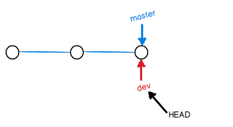
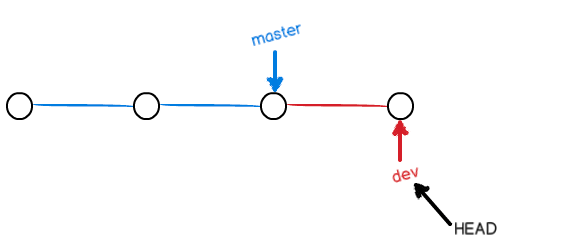
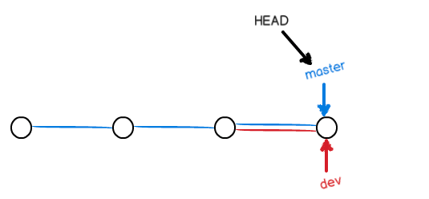
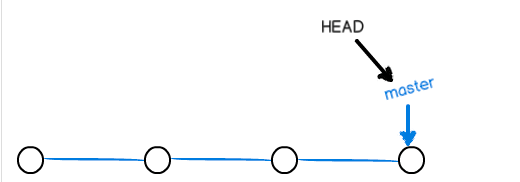
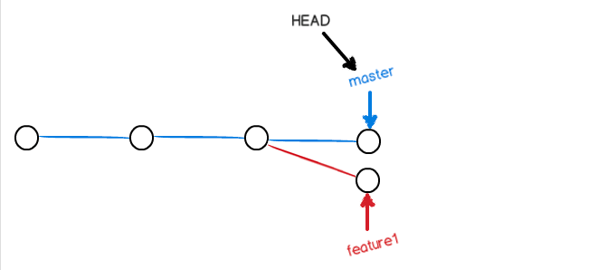
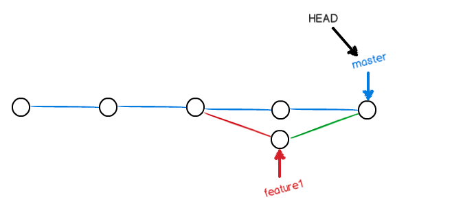

#git 远程仓库
现在，我们根据GitHub的提示，在本地的learngit仓库下运行命令：

`$ git remote add origin git@github.com:michaelliao/learngit.git`

请千万注意，把上面的michaelliao替换成你自己的GitHub账户名，否则，你在本地关联的就是我的远程库，关联没有问题，但是你以后推送是推不上去的，因为你的SSH Key公钥不在我的账户列表中。

添加后，远程库的名字就是origin，这是Git默认的叫法，也可以改成别的，但是origin这个名字一看就知道是远程库。

下一步，就可以把本地库的所有内容推送到远程库上：

```
$ git push -u origin master
Counting objects: 19, done.
Delta compression using up to 4 threads.
Compressing objects: 100% (19/19), done.
Writing objects: 100% (19/19), 13.73 KiB, done.
Total 23 (delta 6), reused 0 (delta 0)
To git@github.com:michaelliao/learngit.git
 * [new branch]      master -> master
Branch master set up to track remote branch master from origin.
```
把本地库的内容推送到远程，用git push命令，实际上是把当前分支master推送到远程。

由于远程库是空的，我们第一次推送master分支时，加上了-u参数，Git不但会把本地的master分支内容推送的远程新的master分支，还会把本地的master分支和远程的master分支关联起来，在以后的推送或者拉取时就可以简化命令。

##从远程库克隆
```
$ git clone git@github.com:michaelliao/gitskills.git
Cloning into 'gitskills'...
remote: Counting objects: 3, done.
remote: Total 3 (delta 0), reused 0 (delta 0)
Receiving objects: 100% (3/3), done.

$ cd gitskills
$ ls
README.md
```

##分支管理

在版本回退里，你已经知道，每次提交，Git都把它们串成一条时间线，这条时间线就是一个分支。截止到目前，只有一条时间线，在Git里，这个分支叫主分支，即`master`分支。`HEAD`严格来说不是指向提交，而是指向`master`，`master`才是指向`提交`的，所以，`HEAD`指向的就是当前分支。

一开始的时候，master分支是一条线，Git用master指向最新的提交，再用HEAD指向master，就能确定当前分支，以及当前分支的提交点：


当我们创建新的分支，例如dev时，Git新建了一个指针叫dev，指向master相同的提交，再把HEAD指向dev，就表示当前分支在dev上：



你看，Git创建一个分支很快，因为除了增加一个dev指针，改改HEAD的指向，工作区的文件都没有任何变化！

不过，从现在开始，对工作区的修改和提交就是针对dev分支了，比如新提交一次后，dev指针往前移动一步，而master指针不变：




假如我们在dev上的工作完成了，就可以把dev合并到master上。Git怎么合并呢？最简单的方法，就是直接把master指向dev的当前提交，就完成了合并：



所以Git合并分支也很快！就改改指针，工作区内容也不变！

合并完分支后，甚至可以删除dev分支。删除dev分支就是把dev指针给删掉，删掉后，我们就剩下了一条master分支：



下面开始实战。

首先，我们创建dev分支，然后切换到dev分支：

```
$ git checkout -b dev
Switched to a new branch 'dev'
```

git checkout命令加上-b参数表示创建并切换，相当于以下两条命令：

```
$ git branch dev
$ git checkout dev
Switched to branch 'dev'
```

然后，用git branch命令查看当前分支：

```
$ git branch
* dev
  master
```
git branch命令会列出所有分支，当前分支前面会标一个*号。

然后，我们就可以在dev分支上正常提交，比如对readme.txt做个修改，加上一行：

```
Creating a new branch is quick.
```
然后提交：

```
$ git add readme.txt 
$ git commit -m "branch test"
[dev fec145a] branch test
 1 file changed, 1 insertion(+)
```
现在，dev分支的工作完成，我们就可以切换回master分支：

```
$ git checkout master
Switched to branch 'master'
```

切换回master分支后，再查看一个readme.txt文件，刚才添加的内容不见了！因为那个提交是在dev分支上，而master分支此刻的提交点并没有变现在，我们把dev分支的工作成果合并到master分支上：

```
$ git merge dev
Updating d17efd8..fec145a
Fast-forward
 readme.txt |    1 +
 1 file changed, 1 insertion(+)
```
git merge命令用于合并指定分支到当前分支。合并后，再查看readme.txt的内容，就可以看到，和dev分支的最新提交是完全一样的。

注意到上面的Fast-forward信息，Git告诉我们，这次合并是“快进模式”，也就是直接把master指向dev的当前提交，所以合并速度非常快。

当然，也不是每次合并都能Fast-forward，我们后面会讲其他方式的合并。

合并完成后，就可以放心地删除dev分支了：

```
$ git branch -d dev
Deleted branch dev (was fec145a).
```
删除后，查看branch，就只剩下master分支了：

```
$ git branch
* master
```
因为创建、合并和删除分支非常快，所以Git鼓励你使用分支完成某个任务，合并后再删掉分支，这和直接在master分支上工作效果是一样的，但过程更安全。


##解决冲突

人生不如意之事十之八九，合并分支往往也不是一帆风顺的。

准备新的feature1分支，继续我们的新分支开发：

```
$ git checkout -b feature1
Switched to a new branch 'feature1'
```

修改readme.txt最后一行，改为：

```
Creating a new branch is quick AND simple.
```
在feature1分支上提交：

```
$ git add readme.txt 
$ git commit -m "AND simple"
[feature1 75a857c] AND simple
 1 file changed, 1 insertion(+), 1 deletion(-)
```
切换到master分支：

```
$ git checkout master
Switched to branch 'master'
Your branch is ahead of 'origin/master' by 1 commit.
```
Git还会自动提示我们当前master分支比远程的master分支要超前1个提交。

在master分支上把readme.txt文件的最后一行改为：

```
Creating a new branch is quick & simple.
```

提交：

```
$ git add readme.txt 
$ git commit -m "& simple"
[master 400b400] & simple
 1 file changed, 1 insertion(+), 1 deletion(-)
```
现在，master分支和feature1分支各自都分别有新的提交，变成了这样：



这种情况下，Git无法执行“快速合并”，只能试图把各自的修改合并起来，但这种合并就可能会有冲突，我们试试看：

```
$ git merge feature1
Auto-merging readme.txt
CONFLICT (content): Merge conflict in readme.txt
Automatic merge failed; fix conflicts and then commit the result.
```

果然冲突了！Git告诉我们，readme.txt文件存在冲突，必须手动解决冲突后再提交。git status也可以告诉我们冲突的文件：

```
$ git status
# On branch master
# Your branch is ahead of 'origin/master' by 2 commits.
#
# Unmerged paths:
#   (use "git add/rm <file>..." as appropriate to mark resolution)
#
#       both modified:      readme.txt
#
no changes added to commit (use "git add" and/or "git commit -a")
```

我们可以直接查看readme.txt的内容：

```
Git is a distributed version control system.
Git is free software distributed under the GPL.
Git has a mutable index called stage.
Git tracks changes of files.
<<<<<<< HEAD
Creating a new branch is quick & simple.
=======
Creating a new branch is quick AND simple.
>>>>>>> feature1
```

Git用<<<<<<<，=======，>>>>>>>标记出不同分支的内容，我们修改如下后保存：

```
Creating a new branch is quick and simple.
```
再提交：

```
$ git add readme.txt 
$ git commit -m "conflict fixed"
[master 59bc1cb] conflict fixed
```

现在，master分支和feature1分支变成了下图所示：



最后，删除feature1分支：

```
$ git branch -d feature1
Deleted branch feature1 (was 75a857c).
```

##分支管理策略

通常，合并分支时，如果可能，Git会用Fast forward模式，但这种模式下，删除分支后，会丢掉分支信息。

如果要强制禁用Fast forward模式，Git就会在merge时生成一个新的commit，这样，从分支历史上就可以看出分支信息。

下面我们实战一下--no-ff方式的git merge：

首先，仍然创建并切换dev分支：

```
$ git checkout -b dev
Switched to a new branch 'dev'
```

修改readme.txt文件，并提交一个新的commit：

```
$ git add readme.txt 
$ git commit -m "add merge"
[dev 6224937] add merge
 1 file changed, 1 insertion(+)
```
现在，我们切换回master：

```
$ git checkout master
Switched to branch 'master'
```

准备合并dev分支，请注意--no-ff参数，表示禁用Fast forward：

```
$ git merge --no-ff -m "merge with no-ff" dev
Merge made by the 'recursive' strategy.
 readme.txt |    1 +
 1 file changed, 1 insertion(+)
```
因为本次合并要创建一个新的commit，所以加上-m参数，把commit描述写进去。

合并后，我们用git log看看分支历史：


##创建标签

在Git中打标签非常简单，首先，切换到需要打标签的分支上：

```
$ git branch
* dev
  master
$ git checkout master
Switched to branch 'master'
```
然后，敲命令git tag <name>就可以打一个新标签：

`$ git tag v1.0`

可以用命令git tag查看所有标签：

```
$ git tag
v1.0
```

默认标签是打在最新提交的commit上的。有时候，如果忘了打标签，比如，现在已经是周五了，但应该在周一打的标签没有打，怎么办？

方法是找到历史提交的commit id，然后打上就可以了：

```
$ git log --pretty=oneline --abbrev-commit
6a5819e merged bug fix 101
cc17032 fix bug 101
7825a50 merge with no-ff
6224937 add merge
59bc1cb conflict fixed
400b400 & simple
75a857c AND simple
fec145a branch test
d17efd8 remove test.txt
...
```
比方说要对add merge这次提交打标签，它对应的commit id是6224937，敲入命令：
`$ git tag v0.9 6224937`

注意，标签不是按时间顺序列出，而是按字母排序的。可以用git show <tagname>查看标签信息：

```
$ git show v0.9
commit 622493706ab447b6bb37e4e2a2f276a20fed2ab4
Author: Michael Liao <askxuefeng@gmail.com>
Date:   Thu Aug 22 11:22:08 2013 +0800

    add merge
...
```

还可以创建带有说明的标签，用-a指定标签名，-m指定说明文字：

`$ git tag -a v0.1 -m "version 0.1 released" 3628164
`

用命令git show <tagname>可以看到说明文字：

```
$ git show v0.1
tag v0.1
Tagger: Michael Liao <askxuefeng@gmail.com>
Date:   Mon Aug 26 07:28:11 2013 +0800

version 0.1 released

commit 3628164fb26d48395383f8f31179f24e0882e1e0
Author: Michael Liao <askxuefeng@gmail.com>
Date:   Tue Aug 20 15:11:49 2013 +0800

    append GPL
```

如果标签打错了，也可以删除：

```
$ git tag -d v0.1
Deleted tag 'v0.1' (was e078af9)
```
因为创建的标签都只存储在本地，不会自动推送到远程。所以，打错的标签可以在本地安全删除。

如果要推送某个标签到远程，使用命令git push origin <tagname>：

```
$ git push origin v1.0
Total 0 (delta 0), reused 0 (delta 0)
To git@github.com:michaelliao/learngit.git
 * [new tag]         v1.0 -> v1.0
```
或者，一次性推送全部尚未推送到远程的本地标签：

```
$ git push origin --tags
Counting objects: 1, done.
Writing objects: 100% (1/1), 554 bytes, done.
Total 1 (delta 0), reused 0 (delta 0)
To git@github.com:michaelliao/learngit.git
 * [new tag]         v0.2 -> v0.2
 * [new tag]         v0.9 -> v0.9
```
如果标签已经推送到远程，要删除远程标签就麻烦一点，先从本地删除：

```
$ git tag -d v0.9
Deleted tag 'v0.9' (was 6224937)
```
然后，从远程删除。删除命令也是push，但是格式如下：

```
$ git push origin :refs/tags/v0.9
To git@github.com:michaelliao/learngit.git
 - [deleted]         v0.9
```

##常用操作
1）在同一个branch上commit

1. git add *
2. git commit -m 'fix:XXX'
3. git fetch
4. git rebase
5. git rebase --continue
6. git add *
7. git rebase --continue
8. git push

1）commit在不同的branch上 同步到master

1. git checkout 4.9.4.appstore 
2. git pull
3. git log - 5
4. git cherry-pick 6de28378c7faa91e47dd4b000e06bfb4d7ab42d4
5. git rebase
6. git rebase --continue
7. git push
