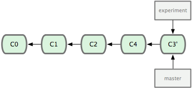

#分支的衍合-rebase
把一个分支中的修改整合到另一个分支的办法有两种：merge 和 rebase（译注：rebase 的翻译暂定为“衍合”，大家知道就可以了。）。在本章我们会学习什么是衍合，如何使用衍合，为什么衍合操作如此富有魅力，以及我们应该在什么情况下使用衍合。

##基本的衍合操作

之前介绍过，最容易的整合分支的方法是 merge 命令，它会把两个分支最新的快照（C3 和 C4）以及二者最新的共同祖先（C2）进行三方合并，合并的结果是产生一个新的提交对象（C5）。如图

1
通过合并一个分支来整合分叉了的历史。
其实，还有另外一个选择：你可以把在 C3 里产生的变化补丁在 C4 的基础上重新打一遍。在 Git 里，这种操作叫做衍合（rebase）。有了 rebase 命令，就可以把在一个分支里提交的改变移到另一个分支里重放一遍。

在上面这个例子中，运行：

```
$ git checkout experiment
$ git rebase master
First, rewinding head to replay your work on top of it...
Applying: added staged command
```
它的原理是回到两个分支最近的共同祖先，根据当前分支（也就是要进行衍合的分支 experiment）后续的历次提交对象（这里只有一个 C3），生成一系列文件补丁，然后以基底分支（也就是主干分支 master）最后一个提交对象（C4）为新的出发点，逐个应用之前准备好的补丁文件，最后会生成一个新的合并提交对象（C3'），从而改写 experiment 的提交历史，使它成为 master 分支的直接下游，如图 3-29 所示：


把 C3 里产生的改变到 C4 上重演一遍。

现在回到 master 分支，进行一次快进合并（见图 3-30）：



现在的 C3' 对应的快照，其实和普通的三方合并，即上个例子中的 C5 对应的快照内容一模一样了。***虽然最后整合得到的结果没有任何区别，但衍合能产生一个更为整洁的提交历史。如果视察一个衍合过的分支的历史记录，看起来会更清楚：仿佛所有修改都是在一根线上先后进行的，尽管实际上它们原本是同时并行发生的。***

一般我们使用衍合的目的，是想要得到一个能在远程分支上干净应用的补丁 — 比如某些项目你不是维护者，但想帮点忙的话，最好用衍合：先在自己的一个分支里进行开发，当准备向主项目提交补丁的时候，根据最新的 origin/master 进行一次衍合操作然后再提交，这样维护者就不需要做任何整合工作（译注：实际上是把解决分支补丁同最新主干代码之间冲突的责任，化转为由提交补丁的人来解决。），只需根据你提供的仓库地址作一次快进合并，或者直接采纳你提交的补丁。

请注意，合并结果中最后一次提交所指向的快照，无论是通过衍合，还是三方合并，都会得到相同的快照内容，只不过提交历史不同罢了。衍合是按照每行的修改次序重演一遍修改，而合并是把最终结果合在一起。

